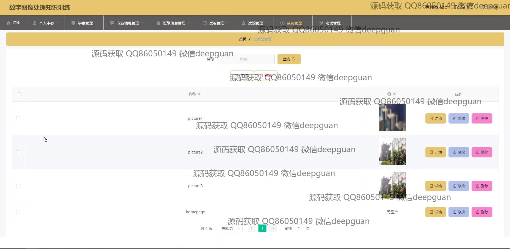

<h1 align="center">数字图像处理训练课程教学系统vue</h1>

## 简介
数字图像处理训练课程教学系统：角色分为管理员、学生；功能包括用户注册与登录、班级和学生管理、试卷和题目编辑、在线测试与考试记录、系统公告与轮播图管理。    --计算机毕业设计源码；毕设源码；java毕业设计源码

## 联系方式

<h3 align="center">获取完整代码与数据库文件 + 微信：deepguan QQ: 86050149 QQ群: 783742310</h3>

<h3 align="center">可帮忙远程部署 包运行成功！提供远程部署、修改代码、设计文档指导、代码讲解等服务！</h3>

## 功能介绍（完整见运行截图）
管理员： 基本功能：登录，注册，退出 系统管理：学生管理，专业信息管理，班级信息管理，系统公告管理 试题管理：选择试题分类与类型，设置选项及答案，分数和题目分析信息管理 试卷管理：试卷创建与管理，考试时长设置，状态调整与提交取消操作 轮播图管理：添加、管理与删除图片功能，提供详细信息查看与编辑 网站公告：添加、修改和删除公告，支持公告标题搜索。

用户： 基本功能：登录，注册，信息更新 个人中心：查看与修改个人信息，包括姓名、性别、专业、班级等 注册与登录：选择角色，填写信息后注册或登录 试卷列表：查看可参与的在线考试，点击进入考试页面 学生功能：搜索与编辑学生信息，支持按学号、姓名、专业和班级过滤。

## 运行截图

本代码来源于网络,仅供学习参考使用!

